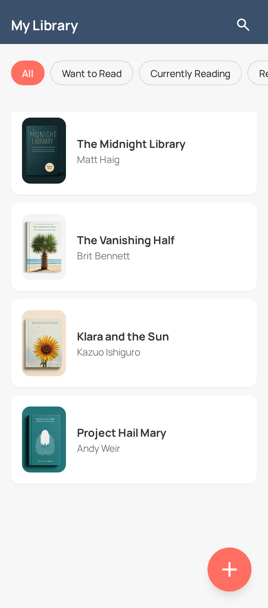
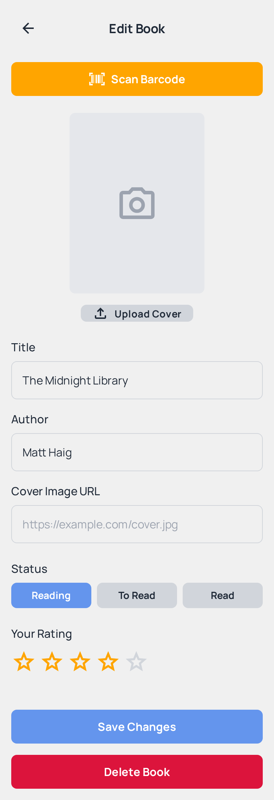

# Pocket Library 📚

---

## 1. Project Idea

Pocket Library is a mobile application designed for book lovers who want to easily track their personal reading journey. It allows users to create a digital catalog of all the books they own, have read, or wish to read in the future. Instead of relying on spreadsheets or memory, users can simply scan a book's barcode to instantly add it to their collection, complete with its cover, summary, and author details. The app serves as a personal librarian right in your pocket, helping you organize your reading life and rediscover the joy of your personal collection, even when you are offline.

---

## 2. Domain Details

The primary entity for this application is the **`Book`**. This object represents a single book within the user's personal library and contains the following fields:

- **`id` (String):** A unique identifier for the book, typically the book's ISBN. This serves as the primary key.
- **`title` (String):** The official title of the book (e.g., "Dune").
- **`author` (String):** The name of the book's author (e.g., "Frank Herbert").
- **`coverImageUrl` (String):** A URL link to an image of the book's cover art, used for visual display.
- **`status` (String):** The current status of the book in the user's library. This will be one of three values: "Want to Read", "Currently Reading", "Read" and "Did Not Finish".
- **`personalRating` (Integer):** The user's personal rating of the book on a scale of 1 to 5. This field can be empty (null) if the book hasn't been rated.

---

## 3. CRUD Operations

The application will support full CRUD (Create, Read, Update, Delete) functionality for the `Book` entity.

- **Create:** A user adds a new `Book` to their library. This is done by tapping an "Add Book" button, which allows the user to either scan an ISBN barcode for an automatic data lookup or enter the details manually. Upon saving, a new `Book` record is created.

- **Read:** A user views the books in their library. This occurs in two ways: viewing the master list of all books on the main screen (which can be filtered by status) and viewing the detailed information for a single book after tapping on it.

- **Update:** A user modifies an existing `Book`. The primary update actions involve changing the book's `status` (e.g., moving it from "Want to Read" to "Currently Reading") or adding/changing a `personalRating` after the book has been read.

- **Delete:** A user removes a `Book` from their library. This is done from the book's detail screen via a "Delete" button, which will prompt for confirmation before permanently removing the record.

---

## 4. Persistence Details

The application uses a hybrid persistence model to ensure data is safe, accessible, and synchronized.

- **Local Database:** All `Book` entities and their data are stored in a local database on the device (e.g., SQLite). All four CRUD operations are first performed locally for a fast, offline-capable experience.
- **Server:** A remote server acts as a backup and synchronization service. The following operations are persisted on both the local database and the server to ensure data integrity across sessions or devices:
  1.  **Create:** A new book is saved locally, then synchronized with the server.
  2.  **Update:** Changes to a book's status or rating are saved locally, then pushed to the server.
  3.  **Delete:** A book is removed from the local database, and a delete command is sent to the server.

---

## 5. Offline Scenarios

The application is designed to be fully functional offline. Here is how each CRUD operation is handled without an internet connection:

- **Offline Create:** A user can add a new book while offline. The new `Book` is saved immediately to the local database and is marked as "pending sync." The app will upload this new entry to the server the next time it connects to the internet.

- **Offline Read:** The user can browse their entire library, view all book details, and see their statuses completely offline, as all data is read directly from the local database.

- **Offline Update:** A user can change a book's status or add a rating while offline. The changes are saved instantly to the local database and queued. The sync operation will run when the connection is restored.

- **Offline Delete:** A user can delete a book while offline. The book is immediately removed from the local database (and the user's view). This action is queued and sent to the server to delete the record from the backup once the device is back online.

---

## 6. App Mockups

|    Book List Screen (List View)    |       Add/Edit Book Screen       |
| :--------------------------------: | :------------------------------: |
|  |  |
